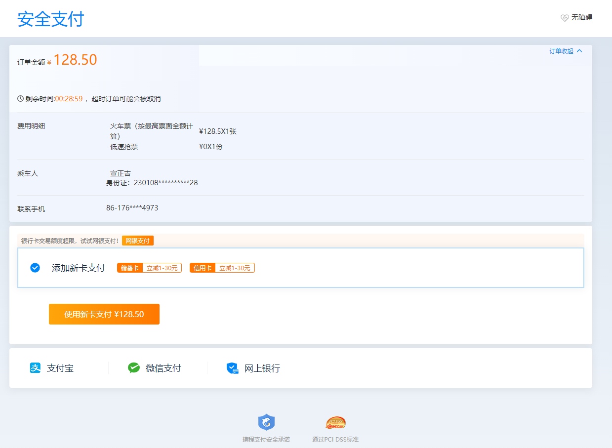
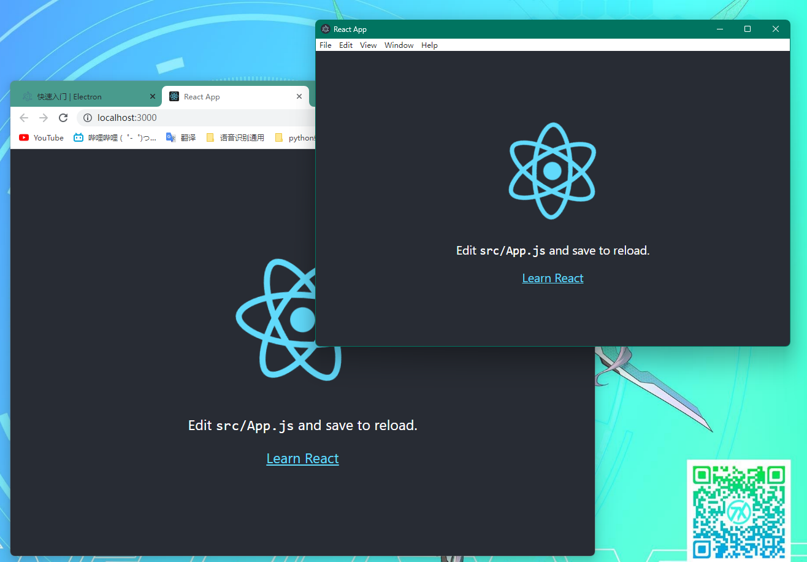
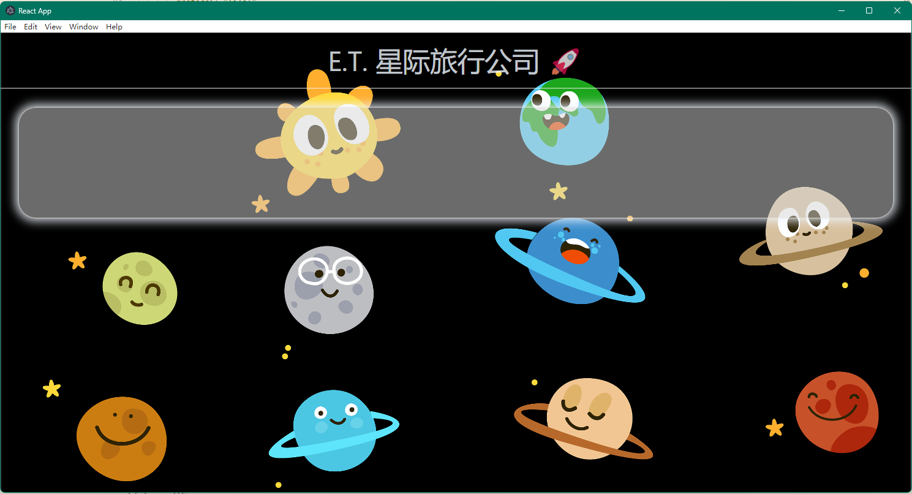
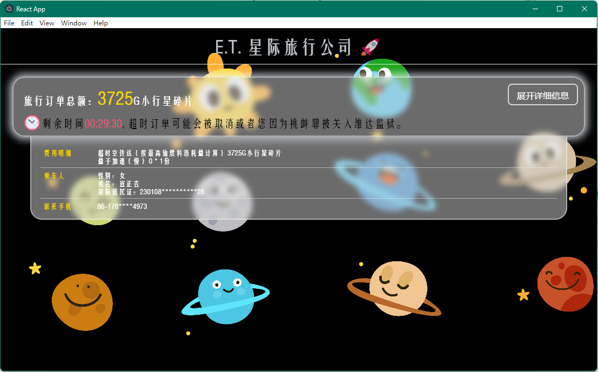
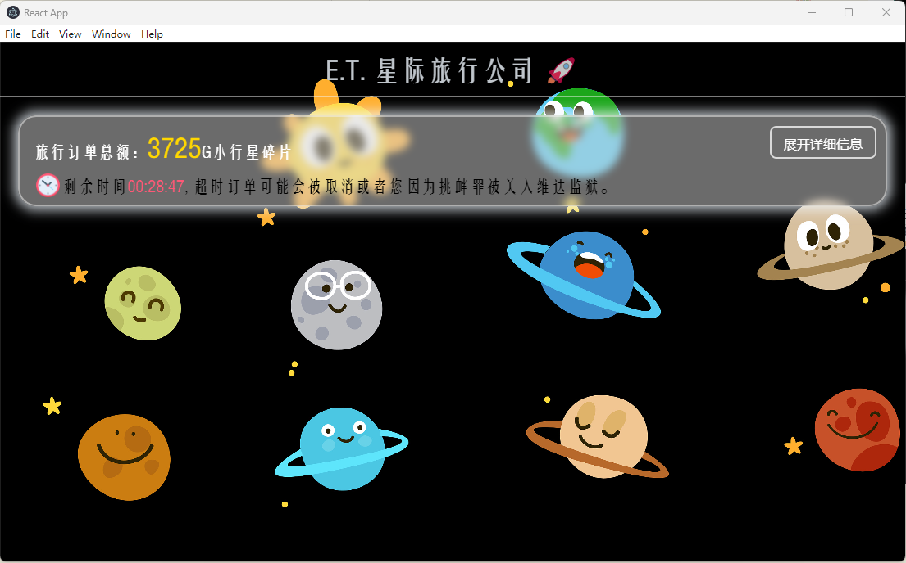
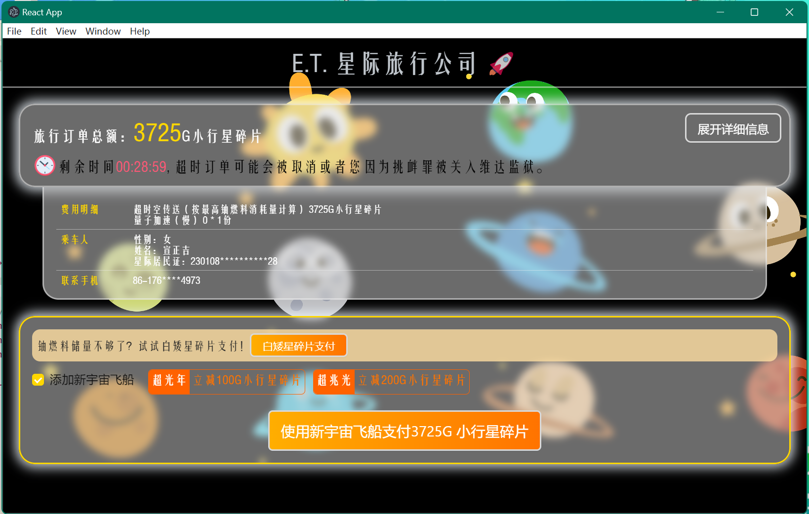
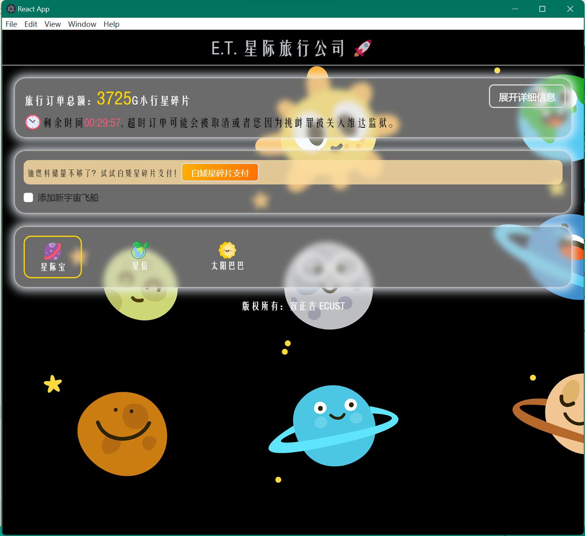
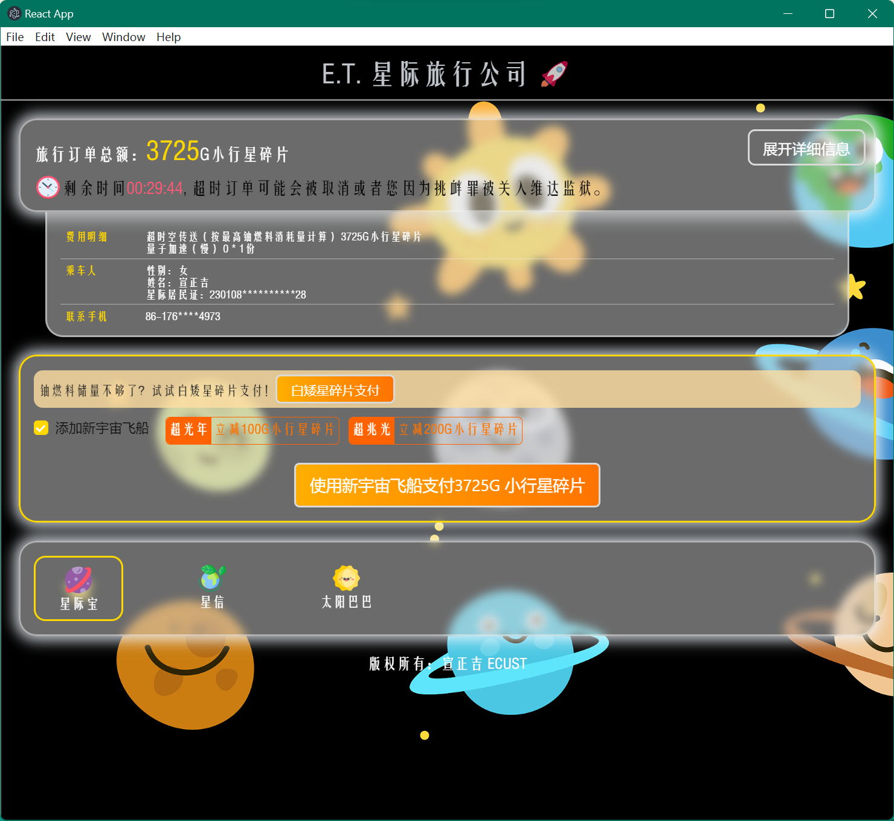
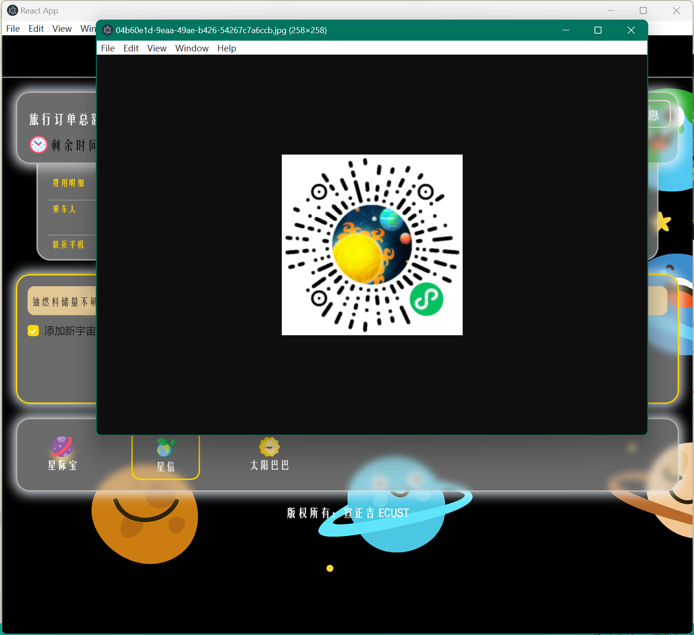

## <font color=skyblue>React</font> + Electron <font color=brown>超时空</font>🌠 星际旅行平台

##### <font color=grey>姓名：宣正吉</font>

##### 此项目已发布在 GitHub：

##### 文件夹内包含构建的 exe 文件，点开即可运行

PS：做完觉得自己做了一个氪金游戏支付界面 😂

---

### 需求分析 🚩

采用 React 和 Electron 设计一个静态页面，可以完成一些基本的支付互动操作，这里考虑将数据分离到 state 当中，React 和 Electron 这两者的结合比较有趣和创新。

为了使用户脱离审美疲劳，我设计了一个未来采用星际物质进行旅行的网页，原始的携程支付界面如下图所示：

大致分为订单结算栏、支付推荐和支付方式选择，下部有公司标识。

- 订单结算栏：包括订单金额【State】、剩余时间结算【定时器】、费用具体信息，包括购买的类型、优惠活动、购票人姓名和身份信息、联系方式等
- 支付推荐：采用其它方式支付的提醒、添加新卡支付、按钮使用新卡支付
- 支付方式选择：三种支付方式，点击后跳出带有二维码的页面，可进行付款操作
- 底部标识：静态展示公司标识
- 顶部菜单的自定义：展示符合星际旅行公司的菜单栏选项

### 环境配置 💻

首先通过 react 手脚架构建一个新的 react 应用，名为`xzj-payment-app`：

```shell
# 安装 create-react-app 命令
npm install -g create-react-app
# 创建项目
create-react-app xzj-payment-app
```

安装 electron 包：

```shell
# 安装 electron 包
npm i --save-dev electron
```

需要在配置文件中修改入口文件和启动命令：

```json
"name": "xzj-payment-app",
"version": "0.1.0",
"main": "main.js",
"private": true,
"homepage": ".",
"dependencies": {
"@testing-library/jest-dom": "^5.16.5",
"@testing-library/react": "^13.4.0",
"@testing-library/user-event": "^13.5.0",
"react": "^18.2.0",
"react-dom": "^18.2.0",
"react-scripts": "5.0.1",
"web-vitals": "^2.1.4"
},
"scripts": {
"electron": "electron .",
"electron-dev": "electron . dev",
"start": "react-scripts start",
"build": "react-scripts build",
"test": "react-scripts test",
"eject": "react-scripts eject"
},

```

然后 Electron 需要一个入口文件`main.js`，但是项目中没有该文件，需要手动加入，下面是其中的详细内容，均按照讲解和自行查阅的资料获得：

```js
const { app, BrowserWindow } = require("electron");

// 引入node的 path 和url模块
const path = require("path");
const url = require("url");
const mode = process.argv[2]; // 获取命令脚本参数

function createWindow() {
  const windowOptions = {
    width: 400,
    height: 300,
  };

  const mainWindow = new BrowserWindow(windowOptions);
  // 加载窗口，直接挂载REACT界面上
  if (mode === "dev") {
    mainWindow.loadURL("http://localhost:3000/");
  } else {
    mainWindow.loadURL(
      url.format({
        pathname: path.join(__dirname, "./build/index.html"),
        protocol: "file:",
        slashes: true,
      })
    );
  }
}

app.on("ready", () => {
  createWindow();
});
```

先运行`npm run start`后再运行`npm run electron-dev`后的效果如图所示：


现在我们就将 REACT 应用挂载到了 Electron 的窗口上。

### 静态页面构建 ☀

这里采用了 AntDesign 样式库设计组件外观等功能，首先根据需求分析的结果，我们先写一个静态页面，没有任何功能，可以先捏造一些数据在 state 当中，首先一个组件一个组件地实现内容，样式单位采用 vw 实现 DOM 大小自适应效果。

采用 position 定位的方式将一张图作为背景，使其充满整个屏幕：


#### 订单结算栏

我在 App 主页面设置了一个状态用于显示细节窗口，当值为 false 时不显示细节栏。首先通过 state 获取数据当中花费金额，渲染到页面上，其次展开按钮的状态受 state 影响，其 value 会随之变化：
<font color="#FF5876">❗ 这里有个比较困难的地方，就是在 useEffect 里面，即订单结算刚刚加载的时候，设置 SetInterval 会出问题，每次都会运行两次，导致时间错误，之后采用 useRef，利用其不随组件 state 变化而重渲染的特性，加 setTimeOut 的方法才设置出正确的定时器。</font>

```js
// App.js
import "./App.css";
import { useState } from "react";
import CheckBox from "./CheckBox";
import Details from "./Details";
import { ConfigProvider } from "antd";

// 主题颜色设置
const defaultData = {
  borderRadius: 6,
  colorPrimary: "#3B8DCC",
};

function App() {
  // 订单数据存放处
  const [data, setData] = useState({
    money: 3725,
    gender: "女",
    name: "宣正吉",
    id: "230108**********28",
    phone: "176****4973",
  });
  // 细节呈展开还是折叠状态，false为折叠
  const [rollup, setRollUp] = useState(false);
  return (
    <ConfigProvider
      theme={{
        token: {
          colorPrimary: defaultData.colorPrimary,
        },
      }}
    >
      <div className="App">
        {/* 欢迎标语 */}
        <div className="Welcome">E.T. 星际旅行公司 🚀</div>
        {/* 订单结算栏 */}
        <CheckBox data={data} roll={rollup} setRollUp={setRollUp}></CheckBox>
        {/* 细节展示栏 */}
        {rollup ? <Details data={data}></Details> : null}
      </div>
    </ConfigProvider>
  );
}

export default App;
```

```js
// CheckBox.js
import "./App.css";
import { Button } from "antd";
import { useEffect, useState, useRef } from "react";

function transTime(sec) {
  //时间转换函数，将秒数转换为小时和秒并返回三个字符串
  let h = parseInt(sec / 3600);
  let m = parseInt((sec - h * 3600) / 60);
  let s = parseInt(sec - h * 3600 - m * 60);

  let hs = h < 10 ? "0" + h : h;
  let ms = m < 10 ? "0" + m : m;
  let ss = s < 10 ? "0" + s : s;
  // console.log(hs, ms, ss);
  return [hs, ms, ss];
}

export default function CheckBox(props) {
  const [time, setTime] = useState(1800); //倒计时时间
  let h = transTime(time);
  const timeRef = useRef(); //设置延时器
  //倒计时
  useEffect(() => {
    //如果设置倒计时且倒计时不为0
    if (time && time !== 0)
      timeRef.current = setTimeout(() => {
        setTime((time) => time - 1);
      }, 1800);
    //清除延时器
    return () => {
      clearTimeout(timeRef.current);
    };
  }, [time]);

  const handleClick = () => {
    // console.log(props);
    props.setRollUp(!props.roll);
  };
  return (
    <div className="CheckBox">
      {/* 总金额 */}
      <div style={{ textAlign: "left", color: "white" }}>
        旅行订单总额：
        <span style={{ color: "gold", fontSize: "3vw" }}>
          {props.data.money}
        </span>
        G小行星碎片
      </div>
      {/* 收起按钮 */}
      <Button className="roll" size="large" onClick={handleClick}>
        展开详细信息
      </Button>
      {/* 倒计时 */}
      <div
        style={{
          textAlign: "left",
          verticalAlign: "middle",
          marginTop: "1vw",
        }}
      >
        
        <span>
          剩余时间
          <span style={{ color: "#FF5876" }}>
            {h[0] + ":" + h[1] + ":" + h[2]}
          </span>, 超时订单可能会被取消或者您因为挑衅罪被关入维达监狱。
        </span>
      </div>
    </div>
  );
}
```

```js
// Detail.js
import "./App.css";

export default function Details(props) {
  return (
    <div className="Details">
      {/* 费用明细 */}
      <div className="pannel">
        <div style={{ width: "9vw", color: "gold" }}>费用明细</div>
        <div>
          <div>
            超时空传送（按最高铀燃料消耗量计算） {props.data.money}G小行星碎片
          </div>
          <div>量子加速（慢） 0 * 1份</div>
        </div>
        <div></div>
      </div>
      {/* 乘车人 */}
      <div className="pannel">
        <div style={{ width: "9vw", color: "gold" }}>乘车人</div>
        <div>
          <div>性别：{props.data.gender}</div>
          <div>姓名：{props.data.name}</div>
          <div>星际居民证：{props.data.id}</div>
        </div>
      </div>
      {/* 联系手机 */}
      <div className="pannel" style={{ borderBottom: "none" }}>
        <div style={{ width: "9vw", color: "gold" }}>联系手机</div>
        <div>86-{props.data.phone}</div>
      </div>
    </div>
  );
}
```

展开效果：

关闭效果：

还有一个定时器用于显示订单超时取消的状态。

#### 添加新的宇宙飞船（商务促销）

这个部分一开始对用户可见的部分可能只有添加新宇宙飞船这个选项，但是通过点击复选框可以显示后面的推荐内容和下面的添加新宇宙飞船按钮，通过 state 控制是否显示这些组件。注意其中如果想要完成点击复选框整个组件加上一个边框的效果，需要用到 useRef 钩子，操作父元素的 DOM：


```js
import "./App.css";
import { useState, useRef } from "react";
import { Button, Checkbox } from "antd";

export default function Rec(props) {
  // 创建ref
  const ref = useRef();
  // 点击添加新卡支付会出现不同的界面
  const onChange = (e) => {
    setCheck(!check);
    if (!check) ref.current.classList.add("booo");
    else ref.current.classList.remove("booo");
  };
  const [check, setCheck] = useState(false);
  return (
    <div className="CheckBox" ref={ref}>
      <div className="rec">
        铀燃料储量不够了？试试白矮星碎片支付！
        <Button className="pay">白矮星碎片支付</Button>
      </div>
      <div className="addNewCard">
        <Checkbox onChange={onChange} style={{ fontSize: "1.5vw" }}>
          添加新宇宙飞船
        </Checkbox>
        {check ? (
          <div style={{ display: "flex" }}>
            <Tag title="超光年" detail="立减100G小行星碎片"></Tag>
            <Tag title="超兆光" detail="立减200G小行星碎片"></Tag>
          </div>
        ) : null}
      </div>
      {check ? (
        <Button
          className="pay"
          style={{
            marginTop: "2vw",
            height: "5vw",
            fontSize: "1.8vw",
          }}
        >
          使用新宇宙飞船支付{props.data.money}G 小行星碎片
        </Button>
      ) : null}
    </div>
  );
}

function Tag(props) {
  return (
    <div className="tags">
      <span>{props.title}</span>
      <span>{props.detail}</span>
    </div>
  );
}
```

#### 选择支付方式

选择支付方式简单占有一栏，当点击相应的支付方式时该
方式添加边框，其它方式没有变化，可以用一个 state 存储选择的支付方式：
这里超过长度之后会出现滚动条，很难看，需要去掉滚动条，而且点击对应支付方式可以弹出窗口。

```js
import { useEffect, useState } from "react";

export default function Choose() {
  const [choose, setChoose] = useState(0);
  //   仅在数据发生改变时更新

  return (
    <div className="CheckBox" style={{ display: "flex" }}>
      <div
        style={{
          //   border: "1px solid grey",
          width: "10vw",
          padding: "1vw",
          borderRadius: "1.3vw",
          marginRight: "5vw",
          cursor: "pointer",
          fontSize: "1.5vw",
          color: "white",
          border: choose == 0 ? "2px solid gold" : "none",
          boxSizing: "border-box",
        }}
        onClick={() => {
          setChoose(0);
          window.open(
            "https://imgweb.kejipro.cn/p3037/t1/202104/04b60e1d-9eaa-49ae-b426-54267c7a6ccb.jpg"
          );
        }}
      >
        
        <div>星际宝</div>
      </div>

      <div
        style={{
          //   border: "1px solid grey",
          width: "10vw",
          padding: "1vw",
          borderRadius: "1.3vw",
          marginRight: "5vw",
          cursor: "pointer",
          fontSize: "1.5vw",
          color: "white",
          border: choose == 1 ? "2px solid gold" : "none",
          boxSizing: "border-box",
        }}
        onClick={() => {
          setChoose(1);
          window.open(
            "https://imgweb.kejipro.cn/p3037/t1/202104/04b60e1d-9eaa-49ae-b426-54267c7a6ccb.jpg"
          );
        }}
      >
        
        <div>星信</div>
      </div>

      <div
        style={{
          //   border: "1px solid grey",
          width: "10vw",
          padding: "1vw",
          borderRadius: "1.3vw",
          marginRight: "5vw",
          cursor: "pointer",
          fontSize: "1.5vw",
          color: "white",
          border: choose == 2 ? "2px solid gold" : "none",
          boxSizing: "border-box",
        }}
        onClick={() => {
          setChoose(2);
          window.open(
            "https://imgweb.kejipro.cn/p3037/t1/202104/04b60e1d-9eaa-49ae-b426-54267c7a6ccb.jpg"
          );
        }}
      >
        
        <div>太阳巴巴</div>
      </div>
    </div>
  );
}
```

### 最终效果展示




